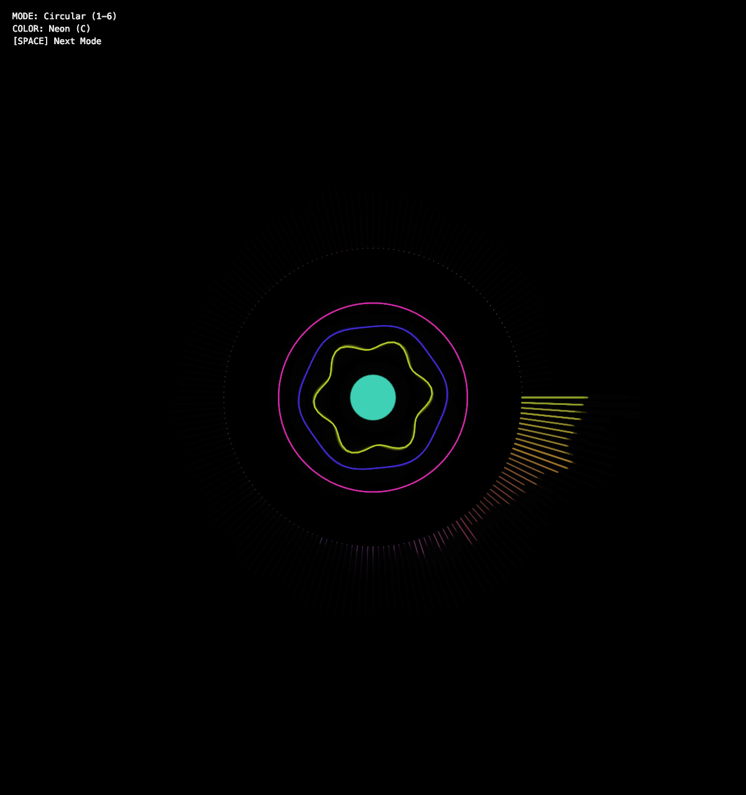
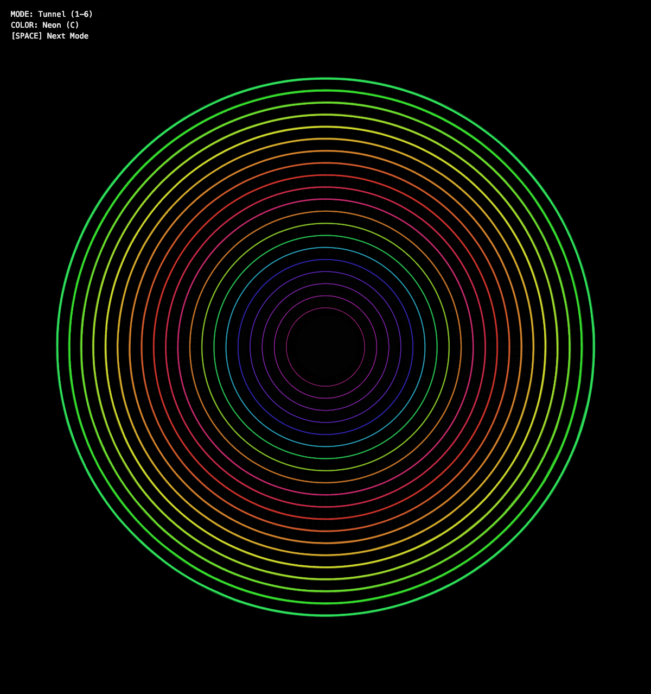
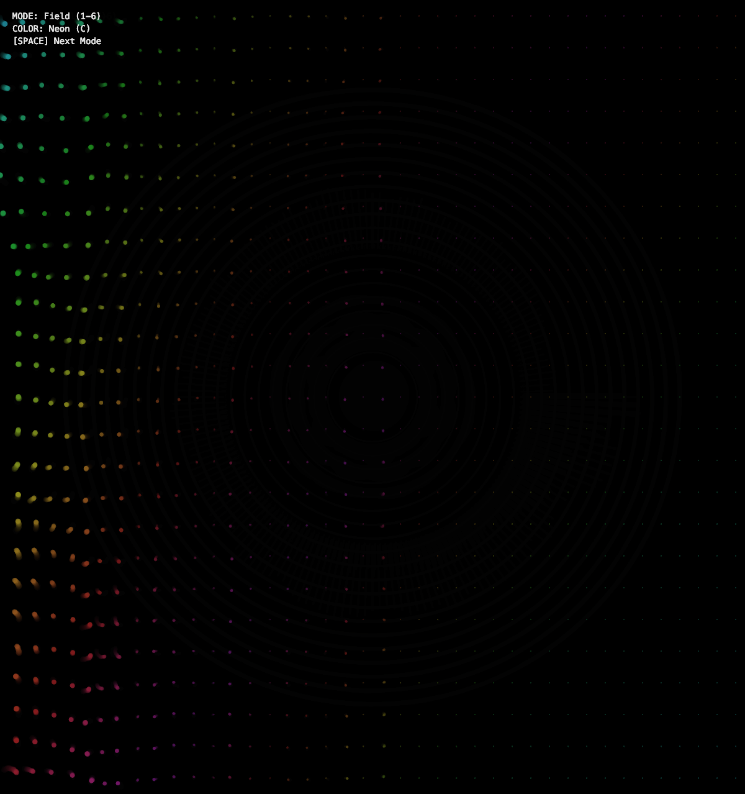
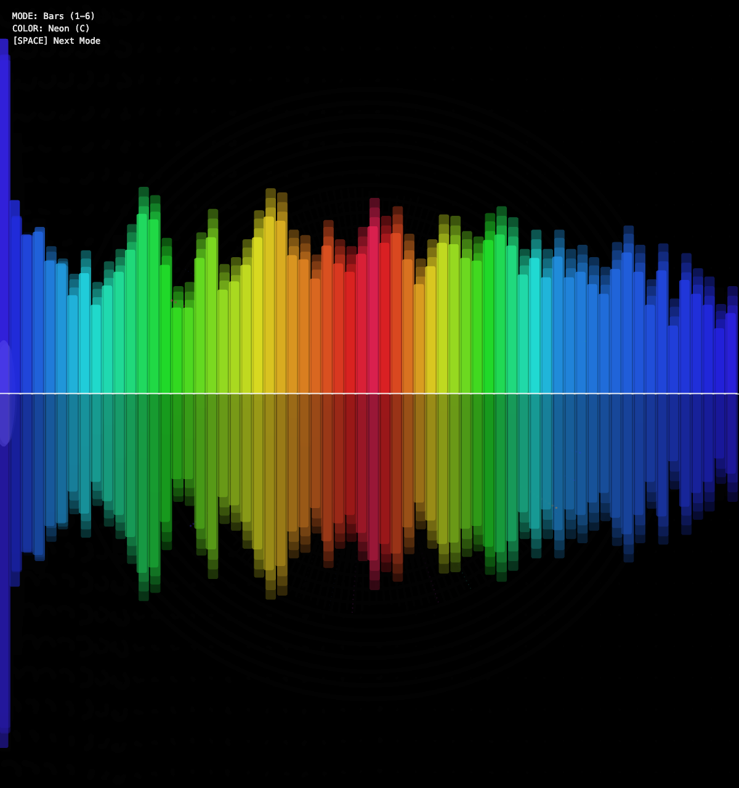
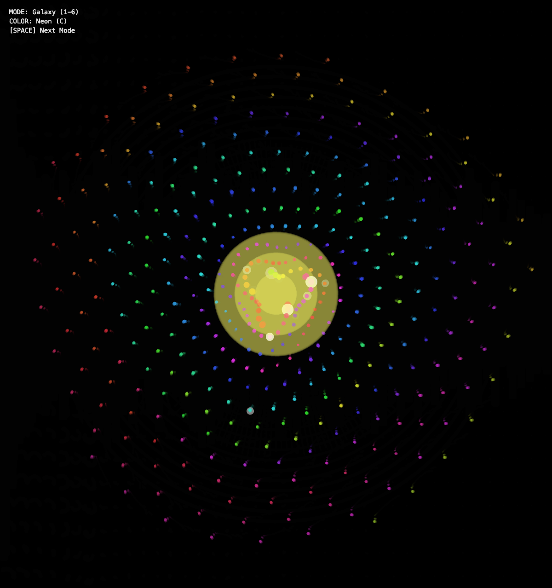
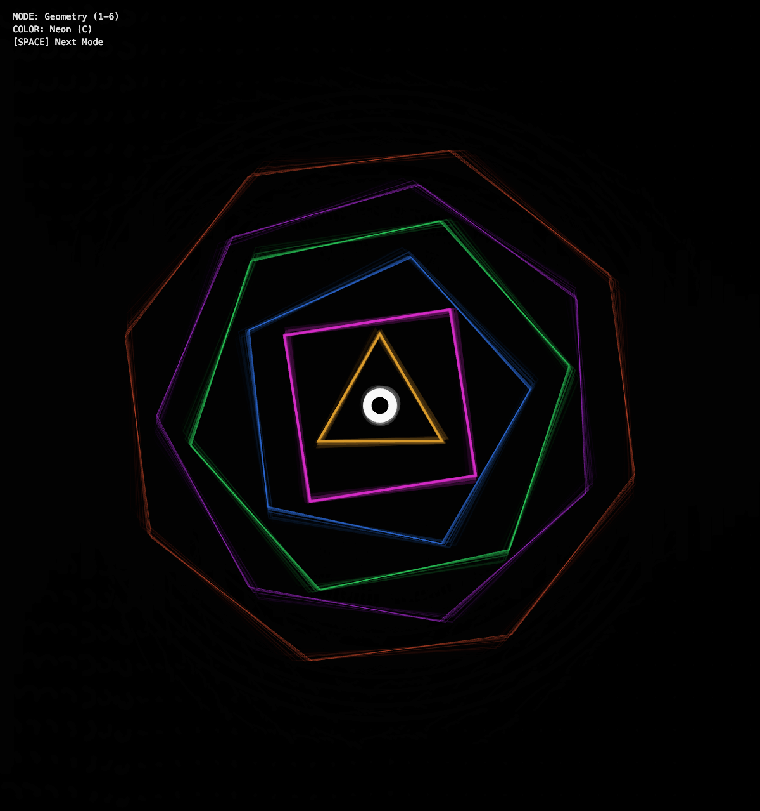

# synesthesia

Audio-reactive visualizer built with p5.js. Turns your microphone input into real-time visuals.

## Demo

| Circular | Tunnel | Field |
|:---:|:---:|:---:|
|  |  |  |

| Bars | Galaxy | Geometry |
|:---:|:---:|:---:|
|  |  |  |

## Run it

```bash
cd synesthesia
python3 -m http.server 8000
# open http://localhost:8000
```

Click "Start", allow mic access, play some music or make noise.

## Controls

| Key | Action |
|-----|--------|
| `1-6` | Switch visualization mode |
| `Space` | Cycle to next mode |
| `C` | Cycle color scheme |

## Modes

1. **Circular** - Spectrum radiates outward with rotating inner rings
2. **Tunnel** - Waveform rings zoom toward you
3. **Field** - Particle grid flows with Perlin noise
4. **Bars** - Classic mirrored frequency bars
5. **Galaxy** - Spiral arms pulse with the beat
6. **Geometry** - Nested shapes (triangle → octagon) breathe with bass/mid/treble

## Color Schemes

Neon, Fire, Ocean, Vapor, Mono

## Features

- Beat detection triggers particle explosions
- Screen shake on heavy bass
- Dynamic trail length based on energy
- Responsive canvas

## Built with

- [p5.js](https://p5js.org/)
- [p5.sound](https://p5js.org/reference/#/libraries/p5.sound)
